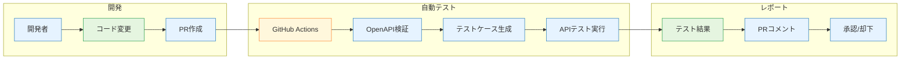
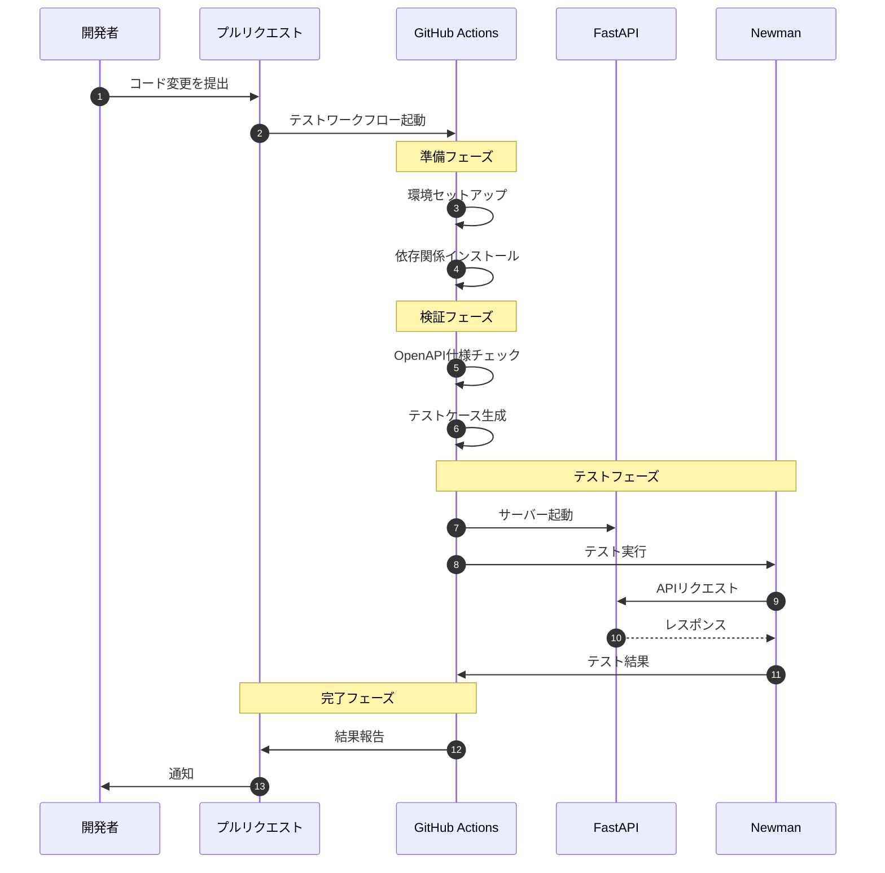
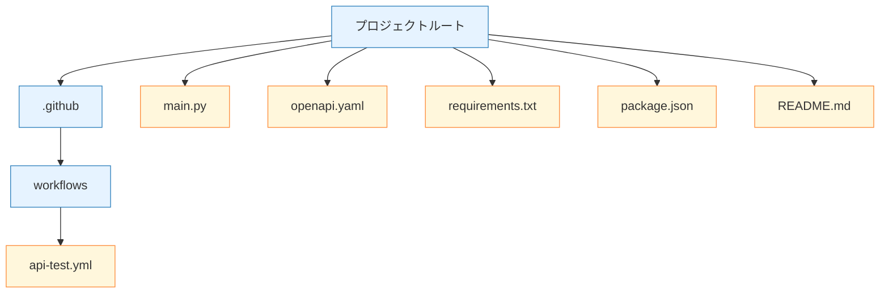

# APIテスト自動化サンプル

このプロジェクトは、FastAPIを使用したREST APIのテスト自動化のサンプルです。GitHub Actionsを使用して、PRごとにAPIテストを自動実行する方法を示しています。

## プロジェクト概要図

### CI/CDパイプライン



### テスト実行フロー



### ディレクトリ構成



### コンポーネント説明

1. **開発フェーズ**
   - 開発者がコードを変更
   - OpenAPI仕様を更新
   - プルリクエストを作成

2. **自動テストフェーズ**
   - GitHub Actionsによる自動実行
   - OpenAPI仕様の検証
   - テストケースの自動生成
   - APIテストの実行

3. **レポートフェーズ**
   - テスト結果の集計
   - PRへの自動コメント
   - 承認/却下の判断材料として活用

### 主要ファイルの役割

- `main.py`: FastAPIアプリケーション本体
- `openapi.yaml`: API仕様定義
- `api-test.yml`: GitHub Actionsワークフロー
- `package.json`: テストツール設定
- `requirements.txt`: Python依存関係

## 機能

- FastAPIによるREST API実装
- OpenAPI (Swagger) による API仕様定義
- PostmanコレクションへのOpenAPI仕様の自動変換
- Newmanを使用した自動テスト実行
- GitHub Actionsによる継続的インテグレーション

## 技術スタック

### バックエンド
- Python 3.11
- FastAPI
- Uvicorn

### テスト自動化
- Newman (Postmanのコマンドラインツール)
- OpenAPI to Postman Converter
- Swagger CLI (OpenAPI仕様の検証)

### CI/CD
- GitHub Actions

## セットアップ手順

1. リポジトリのクローン
```bash
git clone https://github.com/seiya0914/sample_auto_api_test.git
cd sample_auto_api_test
```

2. Python依存関係のインストール
```bash
pip install -r requirements.txt
```

3. Node.js依存関係のインストール
```bash
npm install
```

4. APIサーバーの起動
```bash
python main.py
```

サーバーは http://localhost:8000 で起動します。

## API仕様

APIは以下のエンドポイントを提供します：

### 商品管理API

- `GET /items/`: 全商品の一覧を取得
- `GET /items/{item_id}`: 指定したIDの商品を取得
- `POST /items/`: 新しい商品を追加
- `PUT /items/{item_id}`: 商品情報を更新
- `DELETE /items/{item_id}`: 商品を削除
- `GET /items/search/`: 商品を検索（名前と価格範囲で絞り込み可能）

詳細なAPI仕様は `openapi.yaml` で定義されています。

## テスト自動化の仕組み

### 1. OpenAPI仕様の検証
PRが作成されると、GitHub Actionsが自動的に以下を実行します：
1. OpenAPI仕様（`openapi.yaml`）の構文チェック
2. 仕様に基づくPostmanコレクションの生成
3. Newmanを使用したAPIテストの実行

### 2. テスト結果の確認
テスト結果はPRのコメントとして自動的に投稿され、以下の情報を確認できます：
- OpenAPI仕様の検証結果
- Postmanコレクションへの変換結果
- APIテストの実行結果と詳細なNewmanレポート

## 開発ワークフロー

1. 新機能のブランチを作成
```bash
git checkout -b feature/new-feature
```

2. APIの実装
- `main.py`にエンドポイントを追加
- `openapi.yaml`にAPI仕様を追加

3. PRの作成
- GitHub上でPRを作成
- GitHub Actionsが自動的にテストを実行
- テスト結果をPRコメントで確認

4. レビューとマージ
- テストが成功したことを確認
- コードレビューを実施
- 問題がなければマージ

## トラブルシューティング

### テストが失敗する場合
1. OpenAPI仕様のエラー
   - `openapi.yaml`の構文を確認
   - 必須フィールドが正しく定義されているか確認

2. APIテストの失敗
   - Newmanのテスト出力を確認
   - APIサーバーが正常に起動しているか確認
   - テストケースとAPI実装の整合性を確認

## ライセンス

このプロジェクトはMITライセンスの下で公開されています。
